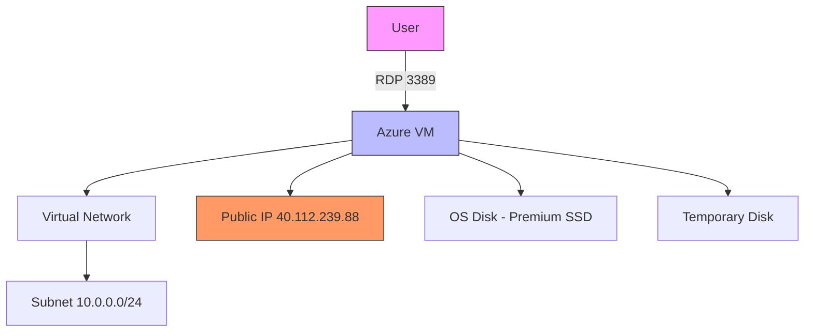

# Azure Virtual Machine Deployment with RDP 

## Overview
This project involved creating a Windows Server virtual machine in Microsoft Azure with Remote Desktop Protocol (RDP) access enabled for administration.

## Architecture Diagram

## Configuration Details
1. ## Basic Configuration
VM Name: NewVM

- Operating System: Windows Server 2022 Datacenter Azure Edition
- VM Size: Standard D51 v2 (1 vCPU, 3.5GB RAM)
- Azure Spot Discount: Enabled
- Hibernation: Disabled

2. ## Authentication
Administrator Account:

Username: [specified during setup]

Password: [secure password configured]

3. ## Networking
- Virtual Network: NewVM-vnet (10.0.0.0/24 subnet)
- Public IP: NewVM-ip (40.112.239.88)

## Inbound Port Rules:
- RDP (3389) enabled for public access

## NIC Security Group: Basic configuration

4. ## Storage
- OS Disk: 127GB Premium SSD (locally-redundant storage)
- Disk Encryption: Platform-managed key encryption at rest
- Temporary Disk: Automatically provisioned

Connectivity: Successful RDP connection established.

  
